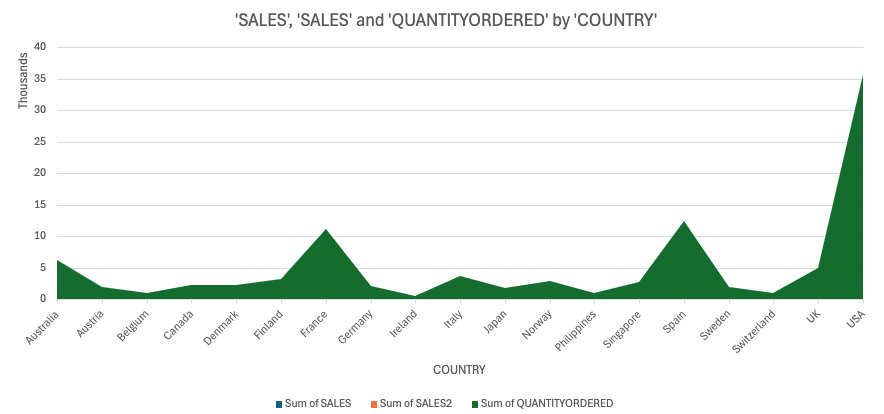
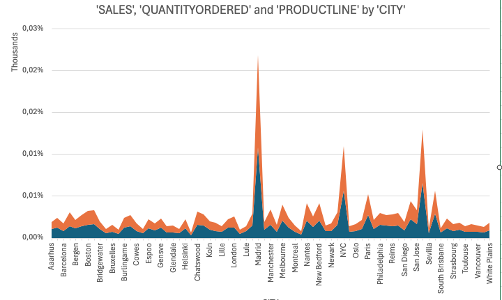
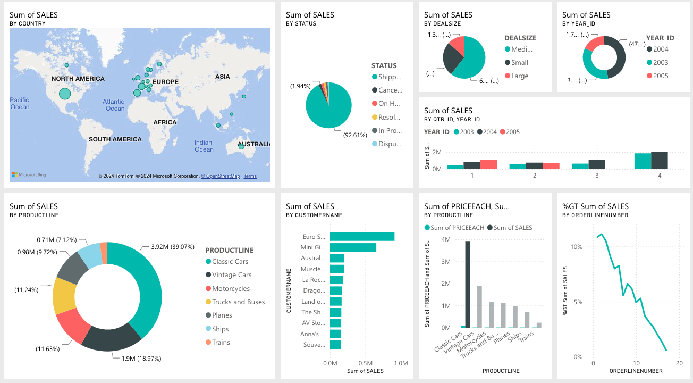

# BusinessAnalysis
# Data Processing and Visualization Workflow

This project covers the **data preparation, transformation, and visualization** processes performed in **Excel** and **Power BI**, including creating dashboards and reports for analyzing sales data. Below are the step-by-step workflows and details.

---

## **Excel Workflow**

### **1. Data Preparation**
- **Autofit Rows and Columns**:
  - Adjusted column widths and row heights to fit content.
- **Remove Duplicates**:
  - Identified and removed duplicate rows from the dataset.
- **Define Correct Column Types**:
  - Ensured columns like "Date" were set to the appropriate format (e.g., Date, Currency).
- **Mark Sales/Price Fields in Red**:
  - Applied cell formatting to highlight sales and price fields.
- **Conditional Formatting**:
  - Added conditional formatting to visually distinguish shipment statuses (e.g., "Delivered" in green, "Pending" in yellow, "Cancelled" in red).

### **2. Handling Null Values**
- Identified null or missing values in key columns and filled them with appropriate values:
  - **Numeric Fields**: Replaced nulls with `0`.
  - **Categorical Fields**: Replaced nulls with "Unknown" or a default value.

### **3. PivotTables**
Created PivotTables to analyze data across dimensions:
- **Metrics**: Total Sales, Quantity Ordered.
- **Dimensions**: 
  - Status
  - Product Line
  - Customer Name
  - Order

### **4. PivotCharts**
- Added dynamic PivotCharts for visualizing data from PivotTables:
  - Bar Chart for **Sales by Product Line**.
  - Pie Chart for **Order Status**.

---

## **Power BI Workflow**

### **1. Report Creation**
- Loaded the dataset into Power BI Service (web version via Microsoft 365).
- Created reports with visualizations:
  - **KPI Cards**:
    - Total Sales
  - **Clustered Column Chart**:
    - Revenue and Profit by Product Line.
  - **Line Chart**:
    - Trends in Sales by Various Factors.
  - **Map Visualization**:
    - Regional distribution of sales.

### **2. Dashboard Creation**
- Designed an interactive dashboard for **Sales Analysis**:
  - Pinned visuals from reports, such as:
    - KPI Cards
    - Clustered Column Charts
    - Slicers for filtering by Year.
  - Enabled drill-through functionality to explore details by Customer or Region.

---

## **Instructions for Use**

### **Excel**
1. Open the `.xlsx` file provided in the repository.
2. Review:
   - Conditional formatting for shipment statuses.
   - PivotTables and PivotCharts for sales and customer insights.
3. Modify or expand the PivotTables/Charts as needed.

### **Power BI**
1. This project is invite only.

---

## **Example Visualizations**

### **Excel PivotChart Example**

### **Power BI Dashboard**

---

## **Additional Notes**
- Ensure data integrity by reviewing cleaning steps for null values, duplicates, and formats.
- Modify slicers and visuals in Power BI to fit additional business requirements.
- Visualizations can be updated dynamically as new data is added.
